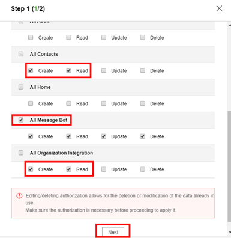
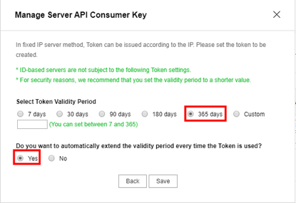
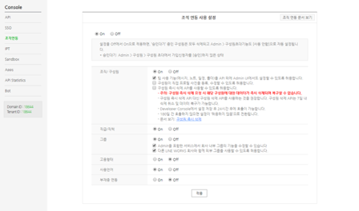

## 1. admin 계정 설정/조회
## 2. 일정봇 메시지 타입 생성
https://developers.worksmobile.com/kr/document/1005008?lang=en
## 3. develop console 로그인, 파라미터 설정
1. console> API : domainID 조회 , API ID, server API consumer key, server list(ID Registration Style) 설정
1. server API consumer key 생성 시, samplebot에서 필요하는 설정, 사용기간 설정
1. server list에server 추구후, 비밀키 다운로드필요

    > https://developers.worksmobile.com/kr/document/1002002?lang=en
1. console>SSO : External Key Mapping 설정
해당 파일을다운로드후external key 추가 후, 다시 업로드필요.
(봇을 사용하는 모든 사용자상대로external key 생성필요 해당키는 유니크해야 함.)
1. console>조직 연동: 캡쳐 참조하여, 체크된 사항과 동일하게 설치필요。

## 4. bot 설치파일 업데이트
1. 다운받은 봇에서 `calender/constants/common.py` 에 진입하여, 관련된 도메인정보 수정
    * 11 줄 `LANG`: 우선 사용되는 언어
    * 12 줄 `ADMIN_ACCOUNT`: 도메인 관리자 계정
    * 13 줄 `DOMAIN_ID`: 도메인 계정에 해당하는 domain id
    * 16 줄 `API_ID`: 생성한 API ID
    * 17 줄 `CONSUMER_KEY`: 생성한 consumer key
    * 18 줄 `SERVER_ID`: 생성한 server ID
    * 19 줄 `PRIVATE_KEY_NAME`: 서버 추가 후 받은 비밀키
1. 비밀키 path 업데이트
해당 파일 아래 동일한 비밀키 입력? - 모르겠음
